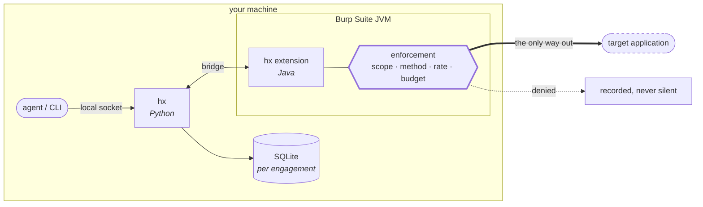

# hx

An agent-driven web application security assessment harness that uses **Burp Suite
Community as an engine, not a frontend**.

Burp Community has no scanner, no automation API and no session handling. `hx` supplies
those from the outside: a Java extension inside Burp's JVM enforces safety policy, a
Python side drives it over a local socket, and everything either of them observes lands in
a per-engagement SQLite database that a report is rendered from.

`hx` does not bundle, redistribute, or modify Burp Suite. You bring your own copy.



Everything `hx` sends crosses that one box. The Python side cannot go around
it — it can only ask.

---

## Documentation

| | |
|---|---|
| **[Install guide](docs/INSTALL.md)** | Prerequisites, building the extension, proving it works |
| **[User guide](docs/USER-GUIDE.md)** | An engagement end to end, and how to read the report |
| **[Architecture](docs/ARCHITECTURE.md)** | Where enforcement lives and why it is in Java |
| **[Decisions](docs/DECISIONS.md)** | What was measured, what was only argued, and the debt |
| **[Contributing](CONTRIBUTING.md)** | The three suites and the house rules |
| **[Security](SECURITY.md)** | Reporting a vulnerability in `hx` itself |

---

## The safety model, first

`hx` exists to send crafted requests at systems that belong to somebody else. Every design
decision below follows from that, and none of it is optional at runtime.

**One enforcement point, inside the JVM.** Every byte that leaves the machine crosses
either the send path or the proxy request handler, both in `extension/`. There is no third
route, and the Python side cannot reach past either — it can only ask. A bug in Python
cannot widen scope.

**Deny-all by default, and terminal.** An unconfigured extension refuses everything. A
`halt` is not a pause: once the sentinel exists, the run is over and no later message
re-opens it.

**Written down or it does not happen.** An under-specified engagement config is a *safe*
config — production profile, mutating and DoS checks off, a low rate limit. Anything that
increases blast radius has to be typed into `config.yaml`, where it is recorded and
reviewable.

**The operator is not the agent.** The method allowlist, dangerous-path denylist, rate
limit and budget apply in full to `hx`'s own traffic and not at all to your browser. The
two are told apart by *which proxy listener the request arrived on* — never by anything in
the traffic itself, which could be forged.

**A report that cannot tell "tested, clean" from "never reached" is worse than no report.**
Coverage is part of the deliverable. A check that could not run says so, by name, with a
reason.

---

## Requirements

| | |
|---|---|
| Python | 3.12+ |
| Java | 21 (to build the extension) |
| Burp Suite | Community 2026.7.3 (any recent Community build should work) |
| Montoya API | `montoya-api.jar` — the extension API, from [Maven Central](https://central.sonatype.com/artifact/net.portswigger.burp.extensions/montoya-api) |

## Install

```bash
uv sync                                    # or: pip install -e .
MONTOYA_JAR=/path/to/montoya-api.jar ./extension/build.sh
export HX_BURP_JAR=/path/to/burpsuite_community.jar
```

Then prove it: `.venv/bin/pytest -q`, `./extension/test.sh`, and
`.venv/bin/pytest -m integration -q`. Full detail, including what a good run
looks like and what the two different kinds of integration-suite failure mean,
is in the **[install guide](docs/INSTALL.md)**.

## Quickstart

```bash
hx new demo --client "Demo Ltd" --scope 'https://app.demo.test/*' --profile staging
hx capture start --kind browse       # browse the app through the proxy, then:
hx capture stop
hx scan
hx report                            # -> <engagement>/exports/
```

The **[user guide](docs/USER-GUIDE.md)** covers crawling, triage, the web app,
halting, and driving `hx` from an agent.

## Use

```bash
hx new acme-2026 --client "Acme Ltd" --scope 'https://app.acme.test/*'
hx capture start                           # launches Burp; browse the target through it
hx capture stop
hx scan                                    # runs the check corpus against what was seen
hx report --out report.md
```

`--scope` is repeatable and at least one is required; `--exclude` takes patterns out again.
`hx capture start` and `hx scan` each take `--burp-jar` if yours is not where `hx` looks,
and `--max-requests` to override the engagement's budget for that run.

`hx halt` stops everything immediately and permanently for that engagement; `hx resume`
starts a new run rather than reviving the halted one. `hx info` prints engagement state.

---

## Tools

The tool layer is the interface an *agent* drives, as opposed to `hx new` / `hx capture` /
`hx scan` above, which are human acts. It is an allowlist (`hx.tools.registry.TOOLS`), a
fail-closed JSON Schema validator, and one dispatcher every call goes through — `hx.tools
.dispatch.dispatch(ctx, name, args, why=...)`. `hx tool` is the first transport over it; an
MCP adapter over the same `dispatch` is future work.

```bash
hx tool --list
hx tool surface.query --json '{"untested":true}' --root path/to/engagement
```

`hx tool --list` needs no engagement; every other call needs `--root` pointed at one.
`--why` is required for any tool that changes state — it is written to `agent_action`, the
journal `run.journal` and `run.resume` read back.

Every call answers with an envelope carrying one of five outcomes:

- **`ok`** — the tool ran and returned something.
- **`empty`** — the tool ran and matched nothing; not the same as a broken tool.
- **`unavailable`** — the tool could not run (no open run, no live session, ...).
- **`refused`** — a gate said no (bad arguments, a halt, an unregistered name, ...).
- **`error`** — a defect in `hx` itself, not a decision about the request.

`hx tool`'s exit status follows whether the tool *ran* (`ok`/`empty` → 0), not the outcome
itself — a query that matched nothing is not a shell failure.

Every call is checked in a fixed order, and the first rule that matches wins:

```
not_registered -> halted -> missing_why -> bad_args -> no_session
```

**All seventeen tools spec section 8 names are built.** Eleven need no session and
work from any adapter: `run.start`, `run.finish`, `run.journal`, `run.resume`,
`surface.query`, `surface.detail`, `finding.record`, `finding.query`, `evidence.attach`,
`checks.list`, `report.render`. Six touch the wire — `http.send`, `http.grep`,
`http.body`, `http.replay_as`, `scan.run`, `crawl.run` — and of those, four need a live
session (`needs_egress`); `http.grep` and `http.body` read the stored blobs, so an agent
that has finished its run can still read what it captured. `crawl.run` drives the same crawler as
`hx crawl`, bounded and synchronous, so an agent can sweep a newly-found area without
leaving its session.

**The four egress tools work under `hx mcp`, not under `hx tool`.** `hx.session.session()`
tears Burp down on every exit and each `hx tool` call is its own process, so there is
nothing there for a session to outlive. `run.start` says so by name — `session: {live:
false, reason: "no_host"}` — rather than leaving those tools to answer a generic
`no_session`. `hx mcp` is one long-lived process: `run.start` brings a Burp up on its
`ExitStack` and `run.finish`, or any exit at all, takes it down.

```bash
hx mcp --root path/to/engagement    # newline-delimited JSON-RPC 2.0 on stdio
```

Three more —
`engagement.create`, `surface.add`, `finding.set_status` — are deliberately never
tools at all: creating an engagement and confirming a finding are human acts, and stay in
the CLI and the web app below.

**`hx web` serves the read-only web app.** It is a browser window onto an engagement
store — the overview, surfaces, findings, a finding's evidence chain and the raw exchange
behind it — plus the same two human acts as the CLI: confirming or dismissing a finding,
and hitting STOP.

```bash
hx web --base path/to/engagements    # serves http://127.0.0.1:8901
```

It binds `127.0.0.1` only and **there is no `--host` option** — S11 fixes the terms for
serving wider than loopback (a per-install bearer token, landing before the first write
endpoint), neither ships here, so the operator has no flag to get the binding wrong.
`--base` names the engagements *parent* directory, matching `hx new --root`; every other
command's `--root` is one engagement's own directory, and that inconsistency predates this
command (see `docs/DECISIONS.md`). The only two things a request can change are a
finding's triage status and the halt — everything else is a read.

```bash
hx triage f-xyz --status confirmed
hx triage f-xyz --status false_positive --note "staging only; the CDN sets it in prod"
```

`hx triage` is the same act from a terminal: `--note` is required for `false_positive` —
it reaches the client deliverable — and optional for `confirmed`.

---

## What it does today

**Discovery has two sources.** `hx` sees the application as you browse it through Burp,
and `hx crawl` drives Burp's own bundled Chromium over in-scope pages. Both land in the
same store; a surface records which one found it, so a report can tell what a human
explored from what a machine walked. The crawler follows links and renders JavaScript —
it submits no forms, clicks nothing, and runs unauthenticated, so your own browsing is
still how anything behind a login gets covered.

**Ten checks**, in two classes:

| Class | Checks |
|---|---|
| `passive` — reads captured traffic, sends nothing | `cookie-flags` · `security-headers` · `secret-in-response` · `stack-trace` |
| `active_safe` — idempotent GET probes | `cors` · `open-redirect` · `reflected-input` · `sql-error` · `sql-behaviour` · `path-traversal` |

`active_timing`, `active_mutate` and `active_dos` are check *classes* the config and the
extension already understand; no checks of those classes ship yet.

**Findings persist across runs**, keyed on a nine-part dedupe key, so re-scanning an
engagement updates findings rather than duplicating them.

### Known limitations, stated because the report states them

- **Probes are unauthenticated unless you declare an identity.** `config.yaml` takes an
  `identities` block, and the send path injects it; without one, probes carry no cookie, no
  `Authorization`, and none of the endpoint's other parameters, so against an application
  that requires a session they test the logged-out view. The report says which applied: an
  engagement that declared an identity gets a table of what it issued under, and one that
  declared none gets this limitation in Limits. A login redirect or an authorisation refusal is recorded as
  `inconclusive`, never as clean — but an application that answers a logged-out request
  with a **200 login page** cannot be told apart from one that answered.
- **Active findings are never automatically marked as fixed.** Because of the above, a
  re-scan is not evidence a finding is resolved. Verify an active finding yourself before
  closing it. Passive findings do retire, because they read captured traffic.
- **No out-of-band (OAST) capability.** `hx` ships no blind-only checks and says so in the
  report rather than leaving the gap silent.
- **Cookie and credential-header insertion points are not probed**, because the send path
  refuses credentials it did not inject.

## What is not built yet

**Every item in the design spec's v1 scope is built.** What follows is deferred by
decision, not left undone — each entry names why it was safe to defer, and the report
discloses the gap rather than leaving it silent.

- **Form submission, clicking, and interaction-gated routes.** The crawler follows links
  and renders JavaScript; it does not submit forms or click things. That is the most
  safety-critical paragraph in the design spec — *a crawler that finds "Delete account"
  and dutifully clicks it is the worst possible failure of this system* — so it gets its
  own spec rather than riding along with the navigation backbone.
- **Authenticated crawling.** The crawler runs logged out. Browse the application yourself
  through the proxy; that is how applications behind SSO or MFA get covered.
- **Out-of-band (OAST) capability.** No blind-only checks ship, and the report says so.
- **An async job runner.** `scan.run` and `crawl.run` are synchronous over bounded budgets,
  and a run that exhausts one returns what it found and names the budget that stopped it.
- **`run.diff` and scheduled monitoring.** The schema carries `run.kind = scheduled` and
  `surface.first_seen_run` from day one, so this is a wrapper rather than a rewrite.

The design spec's §13 is the authority on both: what v1 covered, and the "out of v1, with
reasons" table these entries come from. `docs/DECISIONS.md` records the decisions taken
along the way and the outstanding debt.

---

## Development

```bash
uv run pytest                  # unit + fast integration-free suite
uv run pytest -m integration   # launches a REAL headless Burp; needs BURP_JAR
./extension/test.sh            # the Java suite; needs MONTOYA_JAR
uv run ruff check .            # lint gate (CI-blocking)
```

The integration suite is deselected by default because it needs a real Burp. Everything it
drives is **loopback only** — no test in this repository has ever sent a request off the
machine, and the target-server fixture refuses any address outside `127.0.0.0/8`.

Design specs and implementation plans live in `docs/superpowers/`. Plans quote the source
they specify, and `tests/test_plan_matches_repo.py` fails if a quoted block drifts from the
file it names — so a plan cannot silently come to describe code that no longer exists.

See [`docs/ARCHITECTURE.md`](docs/ARCHITECTURE.md) for how the pieces fit, and
[`docs/DECISIONS.md`](docs/DECISIONS.md) for the decisions behind them.

---

## Licence

`hx` is licensed under the **[Apache License 2.0](LICENSE)**.

**Burp Suite is not.** `hx` drives Burp; it does not bundle, redistribute, or
modify it, and no part of Burp Suite is in this repository. You supply your own
copy under your own licence from PortSwigger, and **your use of Burp is
governed by that agreement, not by this one** — read it at
[portswigger.net/burp/eula/community](https://portswigger.net/burp/eula/community).

Two things in that agreement are worth knowing before you build on this:

- Community Edition's grant covers *"internal business purposes (which may
  include the provision of a bespoke consultancy service to clients where You
  are acting in a business advisory capacity)"* — an allowance the Professional
  and DAST terms do not spell out.
- It restricts **automated service offerings**, and `hx` automates Burp. Running
  it as part of your own testing is one thing; wrapping it in a service you sell
  is another, and is a question for your lawyer rather than for this file.

Burp Suite and Burp are trademarks of PortSwigger Ltd. This project is not
affiliated with, endorsed by, or sponsored by PortSwigger.

## Use it lawfully

`hx` sends crafted requests at systems that belong to somebody else. Point it
only at systems you own or have **written authorisation** to test. `hx` records
scope, keeps an audit trail, and refuses to widen either at runtime — but none
of that is permission, and the report it renders says so on every engagement:

> **No authorization record is on file for this engagement.** … Read nothing
> above as evidence that testing was authorised.

Getting and keeping that authorisation is yours.
