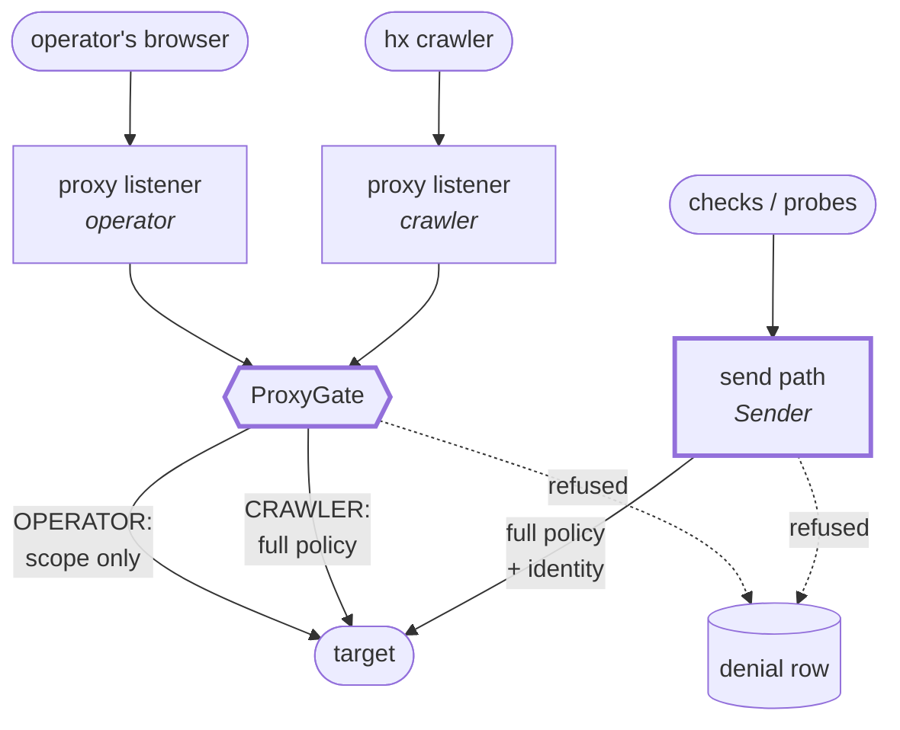
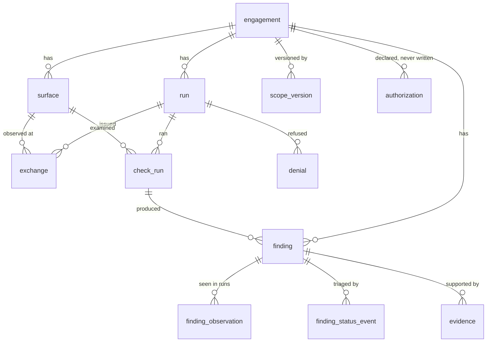

# Architecture

`hx` is two programs that share a socket, plus a database.

```
   your browser ─────┐
                     ▼
        ┌────────────────────────────────────────────┐
        │  Burp Suite Community (JVM)                │
        │                                            │
        │   proxy listener ──┐        ┌── send path  │   ← the only two ways
        │   (operator)       │        │   (agent)    │      out of the machine
        │                    ▼        ▼              │
        │              ┌──────────────────┐          │
        │              │  hx extension    │  policy  │
        │              │  (extension/)    │  lives   │
        │              └────────┬─────────┘  HERE    │
        └───────────────────────┼────────────────────┘
                                │ unix socket, length-prefixed frames
                       ┌────────▼─────────┐
                       │  hx (Python)     │──▶ SQLite + content-addressed blobs
                       │  (src/hx/)       │
                       └──────────────────┘
```

## Why enforcement is in Java

Because that is where the traffic is. Burp's Montoya API hands an extension every proxy
request and every request the extension itself sends; nothing else in the process can
originate HTTP on `hx`'s behalf. Putting the rules there makes them **non-bypassable from
Python**: the Python side has no socket of its own and can only ask the extension to send,
which means a bug, a bad config parse, or a compromised check cannot widen scope. It can
only be refused.

The corollary is that the Java side is small and paranoid, and its test suite (2,330
assertions) is the one that guards the safety envelope.

## The two egress points



Two boxes with a heavy border, and nothing else reaches the network. The
crawler shares the proxy listener with the operator and is told apart from it
by **which listener the request arrived on** — never by anything in the
traffic, which the target could forge.


| | Proxy listener | Send path |
|---|---|---|
| Whose traffic | The operator's browser | `hx`'s own probes, and the crawler |
| Scope | Recorded, not enforced | **Enforced** — out of scope is refused |
| Method allowlist | Not applied | **Applied** |
| Dangerous-path denylist | Not applied | **Applied** |
| Rate limit / budget | Not applied | **Applied** |
| Redaction before storage | Applied | Applied |

The split is deliberate: an operator driving their own browser through Burp should not have
`hx`'s rate limit imposed on them, and a rule that slowed their session down would get
turned off. The two are distinguished **only by which listener the request arrived on** —
never by a header, a marker, or anything else in the traffic, all of which could be forged
by the target.

## The extension (`extension/`)

| Package | Responsibility |
|---|---|
| `policy/` | The gates. `Limiter` (rate + budget), `Policy` (scope, method, dangerous paths), `Decision` (allow / refuse with a class and a reason), `Distress` (auto-halt) |
| `send/` | `Sender` — the agent's egress. `Redactor` strips credentials **before** anything is stored; `HaltSwitch` reads the terminal sentinel; `Limits` arms the budget from the configure frame |
| `proxy/` | `Capture`, `Recorder`, `ProxyGate` — the operator's egress, recorded and redacted but not gated |
| `bridge/` | Frame codec and the client half of the socket |

The published decision order is fixed and every layer agrees on it:

```
not_configured → halted → scope → method → dangerous → rate → budget
```

Earliest match wins. `Limiter` increments its issue counter **only on allow**, so a refused
request spends no budget and never leaves the JVM — which is what makes a client-side retry
after `rate_limited` safe.

## The Python side (`src/hx/`)

| Module | Responsibility |
|---|---|
| `cli.py` | `hx new / info / capture / scan / report / halt / resume` |
| `session.py` | Launches Burp with the extension, serves the bridge, builds the configure body from `config.yaml` |
| `bridge/` | `server.py` (the socket, correlation ids, backpressure), `codec.py` (frames) |
| `capture.py` | Turns exchanges into `surface` rows |
| `surface.py`, `insertion.py` | Path normalisation (`/user/12345` → `/user/{id}`) and where a payload can go |
| `checks/` | `registry.py`, `base.py` (`Verdict`, `Candidate`), `probe.py` (the one route to the wire), `passive/`, `active/` |
| `scan.py` | The runner: per surface, per check, open a row, dispatch, close it |
| `report.py` | Markdown, including the coverage table and the limits disclosure |
| `store/` | `schema.sql` (14 tables), `records.py`, content-addressed `blobs.py` |

### `checks/probe.py` is the only route to the wire

A check does not own a socket and cannot construct one. It is handed a `ProbeSender` bound
to one surface, and two rules are structural rather than documented:

- **A refusal raises**, never returns. A sender that returned a refusal would let a check
  read `budget_exhausted` as a response and answer `clean`.
- **A path still carrying a `{placeholder}` is rejected**, so a check cannot probe a
  template — an address that cannot exist, whose 404 would read as "tested, nothing found".

### Verdicts and retirement

A check returns `finding`, `clean`, or `inconclusive`. `clean` and `finding` carry
`considered` — the issue types the check actually examined — and a finding **retires** when
a later run examines its type and does not find it.

That is sound only if `clean` means "I tested this", which is why active checks do not
populate `considered` at all: an unauthenticated probe cannot distinguish a login page from
an answer, so it may report what it finds but may not close anything. Retirement is a
passive-corpus property.

## The database



Fourteen tables; the twelve above are the ones a report reasons over.
`agent_action` and `quarantine` sit outside it — the audit trail and the
holding pen — and `finding_status_event` is the only writer of a finding's
status, which is why a human act is distinguishable from a tool's.

**`authorization` is declared and never written.** No code path in this build
inserts a row, so the edge is labelled as it reads: the table exists, the
schema anticipates the record, and every report states the record is absent.
It carries the *absence* of the client's written permission, not the
permission. Shown rather than omitted, because a data model that quietly
dropped it would leave a reader to assume authorisation is tracked somewhere.


14 tables in one SQLite file per engagement, `0o600` inside a `0o700` directory. Request and
response bodies live in a content-addressed blob store, and **redaction runs before
hashing** — a credential never becomes a content address.

Findings are keyed on a nine-part dedupe key:

```
check | issue_type | scheme | host | port | method | path_template | insertion_kind | insertion_name
```

so the same issue found on the same surface across runs is one row with many observations,
not many rows.

Two invariants are enforced by the schema rather than by convention: the agent may never
write finding status `confirmed` or `reported` (a trigger refuses it — those are a human's
words), and every vocabulary column is `CHECK`-constrained against the values the code uses.

## Plans quote the code they specify

`docs/superpowers/` holds design specs and implementation plans. Plans embed the source they
specify, and `tests/test_plan_matches_repo.py` compares 144 of those blocks against the
files they name, failing on drift. `scripts/sync_plan_block.py` re-syncs a block when the
code legitimately moves — deliberately requiring the operator to supply the line range for
an excerpt, because a sync that guesses its own region is how a plan quietly comes to
describe code that was never written.
