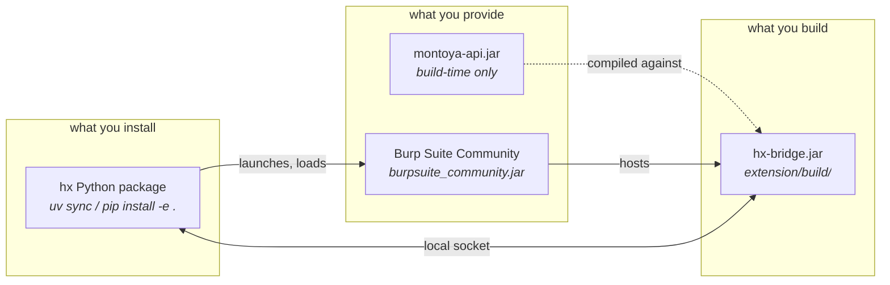

# Installing hx

`hx` is three moving parts: a Python package, a Java extension you build, and a
copy of Burp Suite you supply yourself. This guide gets all three working and
then proves they are, because an install that *looks* fine and cannot reach
Burp fails in ways that are hard to read later.



Only `montoya-api.jar` is build-time. At run time `hx` needs Python, your Burp
jar, and the extension jar it built.

---

## 1. Prerequisites

| | Version | Why |
|---|---|---|
| Python | 3.12+ | `hx` uses 3.12 syntax; older versions will not import it |
| Java | 21 | Builds the extension. Burp itself ships its own runtime |
| Burp Suite | Community 2026.7.3, or any recent Community build | The engine. `hx` never bundles or redistributes it |
| `montoya-api.jar` | matching your Burp | Burp's extension API, needed only to compile |

`uv` is recommended but not required — `pip install -e .` works.

### Getting Burp Suite Community

Download it from [portswigger.net](https://portswigger.net/burp/communitydownload).
`hx` needs the **jar**, not the desktop installer's launcher. If you installed
the desktop build, the jar is inside the install directory.

Tell `hx` where it is, in order of precedence:

```bash
export HX_BURP_JAR=/path/to/burpsuite_community.jar
# or point at a directory holding exactly one jar:
export HX_BURP_LAB=/path/to/burp-lab
```

Two jars in `HX_BURP_LAB` is an error rather than a guess — the report records
the Burp version a finding was produced under, so the choice is not `hx`'s to
make silently.

### Getting `montoya-api.jar`

From [Maven Central](https://central.sonatype.com/artifact/net.portswigger.burp.extensions/montoya-api).
Download the jar for the version matching your Burp build.

---

## 2. Install the Python package

```bash
git clone https://github.com/<your-fork>/hx
cd hx
uv sync                 # or: python3.12 -m venv .venv && .venv/bin/pip install -e .
```

## 3. Build the extension

```bash
MONTOYA_JAR=/path/to/montoya-api.jar ./extension/build.sh
```

This writes `extension/build/hx-bridge.jar`. You will rebuild whenever
`extension/src/**` changes — the test fixtures **refuse to run against a jar
older than its sources** rather than silently testing stale bytecode, so a
forgotten rebuild fails loudly and tells you what to do.

---

## 4. Prove it works

Three suites, in increasing cost. Run all three the first time.

```bash
# 1. Unit tests -- no Burp, no browser, a few seconds
.venv/bin/pytest -q

# 2. The extension's own suite -- needs the Montoya jar
MONTOYA_JAR=/path/to/montoya-api.jar ./extension/test.sh

# 3. Integration -- launches a real Burp; several minutes
.venv/bin/pytest -m integration -q
```

**What good looks like:** the unit suite reports thousands of passes and a
handful of skips. `extension/test.sh` prints one `ALL PASS` line per suite;
the idiom for checking it is `./extension/test.sh 2>&1 | grep -c FAIL`
returning `0`. The integration suite launches Burp repeatedly and takes about
ten minutes.

**If integration tests SKIP**, Burp was not found — that is an absent
instrument, and the summary says which. **If they FAIL with `unbuilt:`**, your
extension jar is older than its sources; run `extension/build.sh` again. Those
two outcomes are deliberately different: a missing instrument is a skip, a
broken measurement is a failure, and collapsing them would let the second pass
as the first.

---

## 5. The browser, if you plan to crawl

`hx crawl` drives **Burp's own bundled Chromium** — it does not download or
ship a browser. Burp fetches that browser the first time you open it, so if
you have never used Burp's built-in browser, do it once by hand:

> Burp → Proxy → Intercept → **Open browser**

After that it lives under `~/.BurpSuite/burpbrowser/<version>/chrome` and `hx`
finds the newest one automatically. Until then, `crawl` refuses with a message
saying exactly this.

The browser is launched **sandboxed**. If the sandbox cannot start, `hx`
refuses to crawl rather than disabling it — it is rendering pages from systems
under test.

---

## Troubleshooting

**`montoya-api.jar not found`** — `extension/build.sh` and `test.sh` take
`MONTOYA_JAR`. The default path is relative and does not resolve from a git
worktree, so set it explicitly. Both scripts refuse to start rather than
compile nothing, because a build that quietly compiles zero files reports
zero failures.

**`unbuilt: extension jar is older than its sources`** — rebuild. The guard
exists because integration tests verify Java enforcement, and testing
yesterday's jar produces green results that mean nothing.

**Two jars found in `HX_BURP_LAB`** — name one with `HX_BURP_JAR`, or pass
`--burp-jar`. `hx` will not pick for you.

**`hx crawl` says no bundled Chromium** — see section 5 above.

**Import errors on Python 3.11 or earlier** — `hx` requires 3.12.

---

## Where things live

| Path | What |
|---|---|
| `~/hx/engagements/<name>/` | One directory per engagement, mode `0700` |
| `<engagement>/hx.db` | The SQLite store, mode `0600` |
| `<engagement>/config.yaml` | Scope, profile, limits, identities |
| `<engagement>/exports/` | Rendered reports |
| `extension/build/hx-bridge.jar` | The extension you built |

Engagement directories are `0700` and database files `0600`, deliberately.
They hold client traffic.

---

Next: **[the user guide](USER-GUIDE.md)** walks an engagement end to end.
