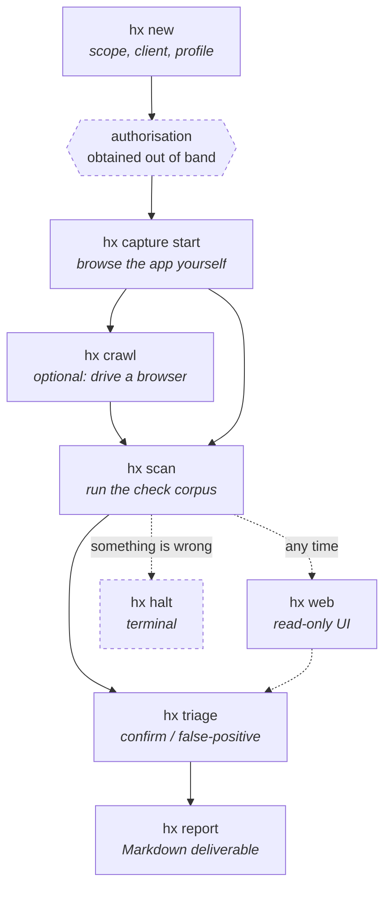

# Using hx

This walks one engagement from nothing to a rendered report. It assumes you
have followed **[the install guide](INSTALL.md)** and that all three suites
pass.

Read [the safety model in the README](../README.md#the-safety-model-first)
first if you have not. The controls described there are not advisory — they
run inside Burp's JVM and the Python side cannot reach past them.

---

## The shape of an engagement



Surface reaches the store three ways — you browsing, the crawler, and the
checks' own probes — and every one of them crosses the same enforcement point.

---

## 1. Create the engagement

```bash
hx new acme-web \
  --client "Acme Corp" \
  --scope 'https://app.acme.test/*' \
  --exclude 'https://app.acme.test/admin/danger/*' \
  --profile staging
```

This writes `~/hx/engagements/acme-web/` (mode `0700`) with a `config.yaml`
and an empty store.

**`--scope` is required and repeatable.** An engagement with no
`scope.include` authorises nothing — the extension denies every request and
tells you the config is the reason.

**`--profile` defaults to `production`, the *safer* of the two.** Production
means a low rate limit and mutating checks off. An under-specified engagement
is a cautious engagement; anything that widens blast radius has to be typed
into `config.yaml`, where it is recorded and reviewable.

### Authorisation

`hx` does not currently record the client's written permission. The report
says so plainly, on every engagement:

> **No authorization record is on file for this engagement.** … Read nothing
> above as evidence that testing was authorised.

Keep your signed authorisation outside the tool. The report will not imply you
had it.

---

## 2. Capture traffic

The highest-quality source of attack surface is **you, browsing the
application**. This is how applications behind SSO or MFA get covered.

```bash
hx capture start --kind browse
```

That launches Burp, opens a run, and holds the session. Point your browser at
the proxy port it prints, use the application normally, then:

```bash
hx capture stop
```

Everything observed becomes `surface` rows with `discovered_by = 'proxy'`.

### Why your browsing is treated differently from the tool's


The two are told apart by **which listener a request arrived on**, never by
anything in the traffic itself, which could be forged. Your browsing is
checked against scope and nothing else — enforcement that drove you off the
proxy would buy nothing. The tool's own traffic gets the full rule set.

---

## 3. Crawl, optionally

```bash
hx crawl --target https://app.acme.test/ --max-pages 200
```

Drives Burp's bundled Chromium over in-scope pages so their requests are
recorded. Surfaces land with `discovered_by = 'crawl'`.

**What this crawler does not do**, stated here and in every report it
touches: it submits **no forms**, **clicks nothing**, walks no route that
needs interaction to reach, and runs **unauthenticated**. Anything behind a
login, behind a button, or reachable only by submitting a form was not found
by it. That is what step 2 is for.

Budgets are `--max-pages`, `--max-seconds` and `--max-requests`. Exhausting
one truncates the crawl, and the printed summary **names which budget stopped
it** — a truncated crawl that presented as an exhaustive one would misstate
coverage.

### When a page could not load itself

```
degraded  1
load-fail 1 page(s) reported they could not load a script or stylesheet they
          asked for -- the app may not have started, so treat the counts
          above as a floor
```

That line means the **browser** told us it refused something the page asked
for — most often a script blocked on its MIME type. The page is recorded
`degraded`, not `rendered`, and the request counts are a floor rather than a
measurement: a single-page application whose main module was refused never
started, so almost nothing it would have fetched was seen.

**Read it as a signal to investigate, not as a diagnosis.** `hx` reports that
the page told it something failed. It does not know why, and the causes are
not all alike:

- the target genuinely does not serve that asset;
- the target serves it with a content type the browser will not execute;
- something between the browser and the target altered or withheld the
  response.

### Confirming what happened

The crawl's own store answers most of this without re-running anything. For an
engagement at `ENGAGEMENT`:

```bash
# What hx actually issued and what came back
sqlite3 ENGAGEMENT/hx.db \
  "SELECT s.path_template, e.status, e.resp_len
     FROM exchange e JOIN surface s ON s.id = e.surface_id
    ORDER BY e.sent_us;"

# Anything the policy refused, and why
sqlite3 ENGAGEMENT/hx.db \
  "SELECT error_class, COUNT(*) FROM denial GROUP BY error_class;"

# What the run itself recorded as issued and dropped
sqlite3 ENGAGEMENT/hx.db "SELECT requests_issued, dropped_total FROM run;"
```

**Check `denial` first — the most likely answer is that `hx` refused the
request itself.** Measured against OWASP Juice Shop, 2026-09-03: its Angular
bundle fired 9 requests in about 130 ms, the staging profile allows 5 per
second, and the four over budget were denied with
`rate limit 5/s: 5 requests issued in the last second`. Burp's `drop()`
answers a denial with **HTTP 200 and an HTML body**, so the browser saw
`200 text/html` where it expected an ES module, refused it under strict MIME
checking, and Angular never started. The crawl saw 5 requests instead of 41.

The safety control did exactly what it should. The problem is what a denial
*looks like*: a rate-limited image is merely missing, but a rate-limited
**module script** stops the whole application, and a `200 text/html` is
indistinguishable from the server legitimately serving a page.

**So a `load-fail` line on a modern single-page application usually means the
rate limit stopped the app from starting, not that the target is broken.**
Raising the limit is not the fix — it is a safety control, and `hx` refuses
edits to a recorded engagement config for good reason. Read the crawl as
covering what it says it covered, and use your own browsing through the proxy
for anything the crawler could not reach.

A request with **no `exchange` row and no `denial` row** did not reach the
proxy at all, which is a different problem and worth knowing before blaming
the target.

Compare against what the application does with no proxy at all — load it in
an ordinary browser and read the console. If the same errors appear there, the
target is broken for everyone and the crawl is reporting a real property of
the application.

**A known target-side cause, worth checking on an unfamiliar server.** A
client speaking to a proxy sends its request line in **absolute form** —
`GET http://host/app.js HTTP/1.1` — rather than the origin form
`GET /app.js HTTP/1.1` ([RFC 9112 §3.2.2](https://www.rfc-editor.org/rfc/rfc9112#section-3.2.2)).
A proxy is expected to convert back to origin form before forwarding, and Burp
does. But some servers mishandle absolute form if they ever see it, and it
costs one command to rule out:

```bash
curl -sI http://TARGET/app.js | grep -i content-type
printf 'GET http://TARGET/app.js HTTP/1.1\r\nHost: TARGET\r\nConnection: close\r\n\r\n' \
  | nc TARGET 80 | grep -i content-type
```

Two different content types means that server mishandles absolute form.
Measured against OWASP Juice Shop, 2026-09-03: `application/javascript` in
origin form, `text/html` in absolute form. **That is a property of that
server, and not established as the cause of any particular `load-fail` line** —
`hx`'s own store showed Burp forwarding origin-form correctly in the run where
this was first seen.

Whatever the cause, the crawl now says its coverage is a floor instead of
reporting a clean page.

---

## 4. Scan

```bash
hx scan --max-seconds 900
```

Runs the enabled check corpus over everything captured so far. Checks are
enabled by *class* in `config.yaml`:

| Class | Default | |
|---|---|---|
| `passive` | on | reads what was already captured; sends nothing |
| `active_safe` | on | sends probes that do not change state |
| `active_timing` | on | **enabled, and this build ships no checks in it** |
| `active_mutate` | off | may change application state |
| `active_dos` | off | may degrade availability |

`active_timing` being on with nothing in it is a real state, and the scan
summary says so out loud rather than letting an enabled-but-empty class read
as a class that ran.

A check that could not run is recorded as `skipped` **by name, with a
reason** — never left absent. Coverage is part of the deliverable.

---

## 5. Triage

Findings arrive as `new`. Only a human moves them:

```bash
hx triage f-3a91c2 --status confirmed
hx triage f-77b104 --status false_positive --note "Input validator, not SQL. Reproduced by hand."
```

`--note` is **required** for `false_positive`, because that note reaches the
client deliverable and a retest has to honour it.

The agent cannot do this. `finding.set_status` is not in the tool layer and a
database trigger refuses the write — confirming a finding is a human act.

### The web app

```bash
hx web --port 8901
```

A read-only view of the store on `127.0.0.1`, plus exactly two buttons: triage
a finding, and STOP. It renders evidence, coverage and status history. It
cannot start a scan.

---

## 6. Report

```bash
hx report
```

Writes one Markdown file to `<engagement>/exports/`.

### Reading it

- **Findings** opens by naming what this build looked for — and names three
  categories it does not cover, so an empty findings list is not read as a
  clean bill of health.
- **Coverage** gives the denominator: surfaces captured, and how many no check
  answered for.
- **Limits** states what could not be tested and why. If a crawl ran, it
  discloses the four things the crawler does not do; if a crawl was
  truncated, it says which budget stopped it.
- Pages recorded `degraded` **may not have rendered** — a third-party resource
  they requested was out of scope and was dropped. The wording is deliberately
  hedged; the classifier errs toward under-claiming.

---

## Stopping, durably

```bash
hx halt --reason "client called, pause testing"
```

A halt is **not a pause**. Once the sentinel exists the run is over, and no
later message re-opens it. Re-arming is a separate, recorded act:

```bash
hx resume
```

---

## Driving hx from an agent

```bash
hx mcp          # serve the tool layer over MCP on stdio
hx tool <name>  # call one tool and print its envelope as JSON
```

The agent gets 17 synchronous tools. What it does **not** get is as
deliberate: it cannot create an engagement, cannot confirm a finding, cannot
widen scope, and cannot start a run it did not open. Tools that change state
require a `why`, which is recorded.

---

## Reference

| Command | What |
|---|---|
| `hx new` | Create an engagement |
| `hx info` | Show config and current counts |
| `hx capture start/stop` | Proxy session for your own browsing |
| `hx crawl` | Drive a browser over in-scope pages |
| `hx scan` | Run the check corpus |
| `hx triage` | Record a human decision on a finding |
| `hx report` | Render the Markdown deliverable |
| `hx web` | Read-only UI on loopback |
| `hx halt` / `hx resume` | Stop issuance durably / re-arm |
| `hx mcp` / `hx tool` | Agent-facing tool layer |

Every command takes `--root` to point at a different engagements directory.

---

See also: **[Architecture](ARCHITECTURE.md)** for how enforcement works, and
**[Decisions](DECISIONS.md)** for why it works that way.
