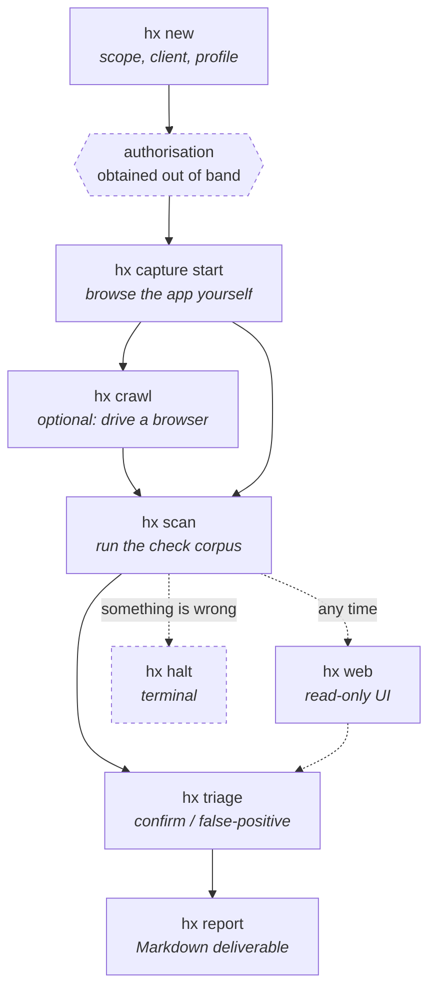
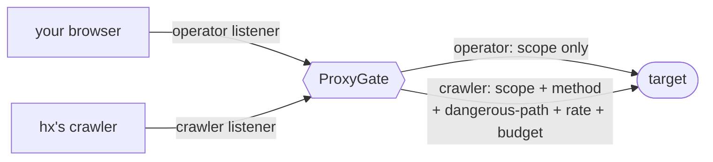

# Using hx

This walks one engagement from nothing to a rendered report. It assumes you
have followed **[the install guide](INSTALL.md)** and that all three suites
pass.

Read [the safety model in the README](../README.md#the-safety-model-first)
first if you have not. The controls described there are not advisory — they
run inside Burp's JVM and the Python side cannot reach past them.

---

## The shape of an engagement



Surface reaches the store three ways — you browsing, the crawler, and the
checks' own probes — and every one of them crosses the same enforcement point.

---

## 1. Create the engagement

```bash
hx new acme-web \
  --client "Acme Corp" \
  --scope 'https://app.acme.test/*' \
  --exclude 'https://app.acme.test/admin/danger/*' \
  --profile staging
```

This writes `~/hx/engagements/acme-web/` (mode `0700`) with a `config.yaml`
and an empty store.

**`--scope` is required and repeatable.** An engagement with no
`scope.include` authorises nothing — the extension denies every request and
tells you the config is the reason.

**`--profile` defaults to `production`, the *safer* of the two.** Production
means a low rate limit and mutating checks off. An under-specified engagement
is a cautious engagement; anything that widens blast radius has to be typed
into `config.yaml`, where it is recorded and reviewable.

### Authorisation

`hx` does not currently record the client's written permission. The report
says so plainly, on every engagement:

> **No authorization record is on file for this engagement.** … Read nothing
> above as evidence that testing was authorised.

Keep your signed authorisation outside the tool. The report will not imply you
had it.

---

## 2. Capture traffic

The highest-quality source of attack surface is **you, browsing the
application**. This is how applications behind SSO or MFA get covered.

```bash
hx capture start --kind browse
```

That launches Burp, opens a run, and holds the session. Point your browser at
the proxy port it prints, use the application normally, then:

```bash
hx capture stop
```

Everything observed becomes `surface` rows with `discovered_by = 'proxy'`.

### Why your browsing is treated differently from the tool's



The two are told apart by **which listener a request arrived on**, never by
anything in the traffic itself, which could be forged. Your browsing is
checked against scope and nothing else — enforcement that drove you off the
proxy would buy nothing. The tool's own traffic gets the full rule set.

---

## 3. Crawl, optionally

```bash
hx crawl --target https://app.acme.test/ --max-pages 200
```

Drives Burp's bundled Chromium over in-scope pages so their requests are
recorded. Surfaces land with `discovered_by = 'crawl'`.

**What this crawler does not do**, stated here and in every report it
touches: it submits **no forms**, **clicks nothing**, walks no route that
needs interaction to reach, and runs **unauthenticated**. Anything behind a
login, behind a button, or reachable only by submitting a form was not found
by it. That is what step 2 is for.

Budgets are `--max-pages`, `--max-seconds` and `--max-requests`. Exhausting
one truncates the crawl, and the printed summary **names which budget stopped
it** — a truncated crawl that presented as an exhaustive one would misstate
coverage.

---

## 4. Scan

```bash
hx scan --max-seconds 900
```

Runs the enabled check corpus over everything captured so far. Checks are
enabled by *class* in `config.yaml`:

| Class | Default | |
|---|---|---|
| `passive` | on | reads what was already captured; sends nothing |
| `active_safe` | on | sends probes that do not change state |
| `active_timing` | on | **enabled, and this build ships no checks in it** |
| `active_mutate` | off | may change application state |
| `active_dos` | off | may degrade availability |

`active_timing` being on with nothing in it is a real state, and the scan
summary says so out loud rather than letting an enabled-but-empty class read
as a class that ran.

A check that could not run is recorded as `skipped` **by name, with a
reason** — never left absent. Coverage is part of the deliverable.

---

## 5. Triage

Findings arrive as `new`. Only a human moves them:

```bash
hx triage f-3a91c2 --status confirmed
hx triage f-77b104 --status false_positive --note "Input validator, not SQL. Reproduced by hand."
```

`--note` is **required** for `false_positive`, because that note reaches the
client deliverable and a retest has to honour it.

The agent cannot do this. `finding.set_status` is not in the tool layer and a
database trigger refuses the write — confirming a finding is a human act.

### The web app

```bash
hx web --port 8901
```

A read-only view of the store on `127.0.0.1`, plus exactly two buttons: triage
a finding, and STOP. It renders evidence, coverage and status history. It
cannot start a scan.

---

## 6. Report

```bash
hx report
```

Writes one Markdown file to `<engagement>/exports/`.

### Reading it

- **Findings** opens by naming what this build looked for — and names three
  categories it does not cover, so an empty findings list is not read as a
  clean bill of health.
- **Coverage** gives the denominator: surfaces captured, and how many no check
  answered for.
- **Limits** states what could not be tested and why. If a crawl ran, it
  discloses the four things the crawler does not do; if a crawl was
  truncated, it says which budget stopped it.
- Pages recorded `degraded` **may not have rendered** — a third-party resource
  they requested was out of scope and was dropped. The wording is deliberately
  hedged; the classifier errs toward under-claiming.

---

## Stopping, durably

```bash
hx halt --reason "client called, pause testing"
```

A halt is **not a pause**. Once the sentinel exists the run is over, and no
later message re-opens it. Re-arming is a separate, recorded act:

```bash
hx resume
```

---

## Driving hx from an agent

```bash
hx mcp          # serve the tool layer over MCP on stdio
hx tool <name>  # call one tool and print its envelope as JSON
```

The agent gets 17 synchronous tools. What it does **not** get is as
deliberate: it cannot create an engagement, cannot confirm a finding, cannot
widen scope, and cannot start a run it did not open. Tools that change state
require a `why`, which is recorded.

---

## Reference

| Command | What |
|---|---|
| `hx new` | Create an engagement |
| `hx info` | Show config and current counts |
| `hx capture start/stop` | Proxy session for your own browsing |
| `hx crawl` | Drive a browser over in-scope pages |
| `hx scan` | Run the check corpus |
| `hx triage` | Record a human decision on a finding |
| `hx report` | Render the Markdown deliverable |
| `hx web` | Read-only UI on loopback |
| `hx halt` / `hx resume` | Stop issuance durably / re-arm |
| `hx mcp` / `hx tool` | Agent-facing tool layer |

Every command takes `--root` to point at a different engagements directory.

---

See also: **[Architecture](ARCHITECTURE.md)** for how enforcement works, and
**[Decisions](DECISIONS.md)** for why it works that way.
